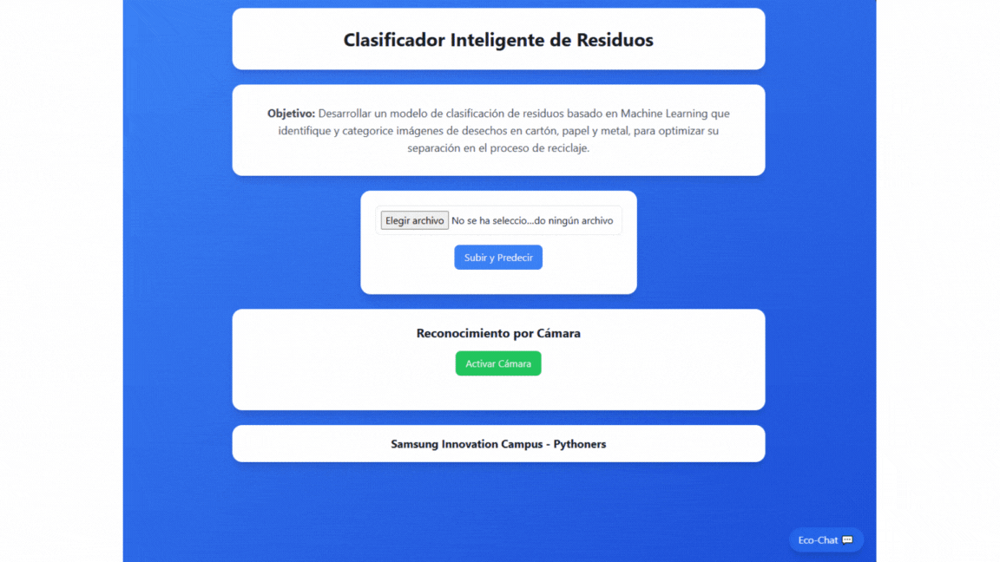
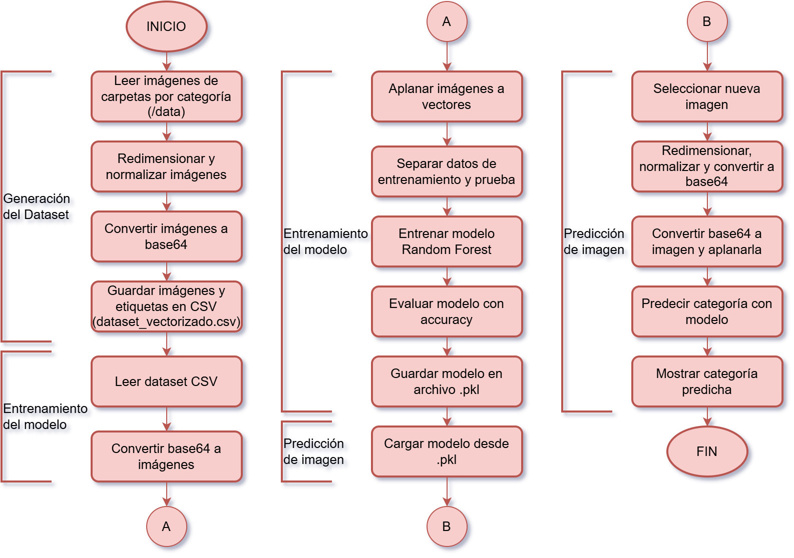
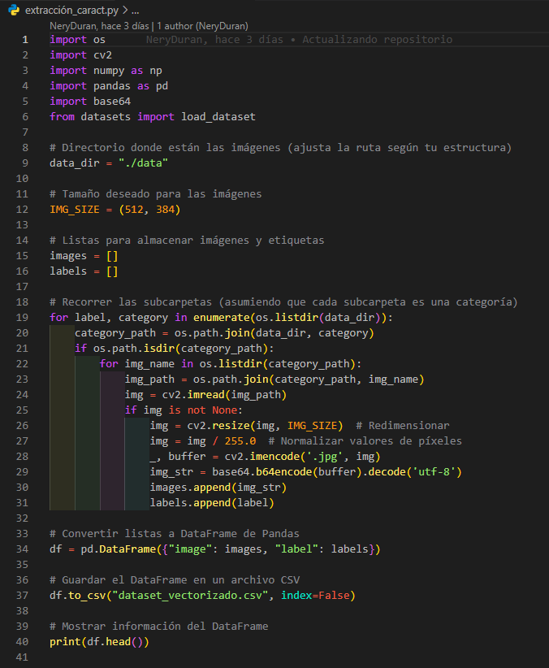

# Clasificador Inteligente de Residuos Reciclables

Conclusiones del proyecto

## Tabla de contenidos

1. [Nombre](#Nombre)
2. [Descripción](#descripción)
3. [Arquitectura](#Arquitectura)
4. [Proceso](#Proceso)
5. [Funcionalidades](#Funcionalidades)
6. [Estado del proyecto](#EstadoDelProyecto)

### Nombre
* Clasificador Inteligente de Residuos Reciclables

### Descripción
Este proyecto consiste en el desarrollo de un modelo de clasificación de residuos utilizando técnicas de Machine Learning. Se implementará un modelo basado en Random Forest para clasificar imágenes de residuos en tres categorías principales: cartón, papel y plástico. El objetivo es facilitar la separación de residuos reciclables mediante un sistema automatizado que pueda ser aplicado en aplicaciones web. Para el entrenamiento del modelo, se utilizará un dataset de imágenes de residuos previamente etiquetadas.

### Arquitectura
- La arquitectura del proyecto se puede visualizar a través del siguiente diagrama de despliegue:
    

- El funcionamiento del proyecto se puede visualizar a través del siguiente diagrama de flujo:
    

### Proceso
* **Fuente del dataset:** https://huggingface.co/datasets/garythung/trashnet

* **Limpieza de datos:**
    

* **Manejo de excepciones / control de errores:**
    

* **Estadísticos (Valores, gráficos, …):**
    (pendiente)

### Funcionalidades

- **Integración del proyecto en una página web:**
    - Enlace: (pendiente)
    - Tecnología/Herramientas usadas …
    - Arquitectura (img)

### EstadoDelProyecto
En proceso de desarrollo