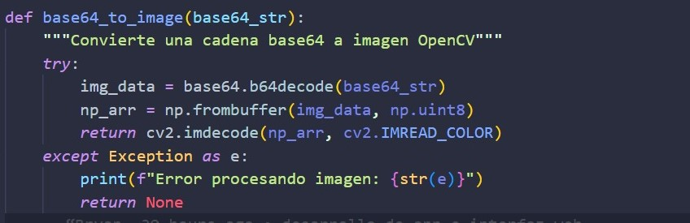
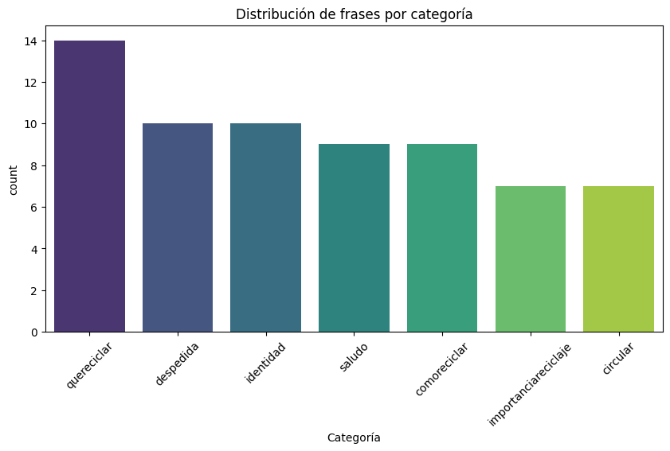

# Clasificador Inteligente de Residuos Reciclables

Con el constante crecimiento de la población y la necesidad de reducir el desperdicio, la economía circular propone un enfoque para reducir la contaminación y el uso de recursos naturales. La economía circular busca reutilizar materiales y productos en lugar de desecharlos, reduciendo el desperdicio y promoviendo la sostenibilidad. En este proyecto, se ha desarrollado un modelo de clasificación de residuos reciclables utilizando técnicas de Machine Learning. Se ha implementado un modelo basado en Random Forest para clasificar imágenes de residuos reciclables en tres categorías principales: cartón, papel y metal. Es de vital importancia preocuparnos por el medio ambiente y reducir el uso de recursos naturales, por lo que el objetivo del proyecto es ayudar a los usuarios a identificar y separar los residuos reciclables de los no reciclables, lo que puede ser útil para reducir el desperdicio y promover la sostenibilidad.  

Además, la implementación de esta tecnología puede facilitar la labor de clasificación en centros de reciclaje y programas de gestión de residuos, optimizando los procesos de separación y reduciendo el esfuerzo humano necesario. Esto no solo mejora la eficiencia en el tratamiento de desechos, sino que también contribuye a la reducción de la contaminación al evitar que materiales reciclables terminen en vertederos o en el medio ambiente.  

Asimismo, este modelo puede servir como base para el desarrollo de sistemas más avanzados en el futuro, incorporando el reconocimiento de una mayor variedad de materiales y mejorando su precisión mediante el uso de redes neuronales más complejas. La integración con dispositivos móviles o sistemas automatizados de recolección permitiría que su impacto llegue a un público más amplio, fomentando la participación activa de la sociedad en la gestión responsable de los residuos.  

En última instancia, la adopción de herramientas tecnológicas como esta refuerza la importancia de la educación ambiental y la responsabilidad colectiva en la protección del planeta. Con el uso adecuado de la inteligencia artificial y el compromiso de las personas, es posible avanzar hacia un modelo de consumo y producción más sostenible, reduciendo la huella ecológica y garantizando un futuro más limpio para las próximas generaciones.

## Tabla de contenidos

1. [Nombre](#Nombre)
2. [Descripción](#descripción)
3. [Arquitectura](#Arquitectura)
4. [Proceso](#Proceso)
5. [Funcionalidades](#Funcionalidades)
6. [Estado del proyecto](#EstadoDelProyecto)

### Nombre
* Clasificador Inteligente de Residuos Reciclables

### Descripción
Este proyecto consiste en el desarrollo de un modelo de clasificación de residuos utilizando técnicas de Machine Learning. Se implementará un modelo basado en Random Forest para clasificar imágenes de residuos en tres categorías principales: cartón, papel y metal. El objetivo es facilitar la separación de residuos reciclables mediante un sistema automatizado que pueda ser aplicado en aplicaciones web. Para el entrenamiento del modelo, se utilizará un dataset de imágenes de residuos previamente etiquetadas.

### Arquitectura
- La arquitectura del proyecto se puede visualizar a través del siguiente diagrama:
    

- El funcionamiento del proyecto se puede visualizar a través del siguiente diagrama de flujo:
    

### Proceso
* **Fuente de los datasets:** https://huggingface.co/datasets/garythung/trashnet

* **Limpieza de datos:**
    

* **Manejo de excepciones / control de errores:**
    - Se debe subir un archivo de imagen si se desea realizar la predicción, si se usa el botón "Subir y Predecir":
        
    - Manejo de excepción en caso de que no se cargue el modelo o la imagen:
        
    - Manejo de excepción en caso de que no se pueda hacer la predicción:
        

* **Estadísticos (Valores, gráficos, …):**
    1. Metricas y graficos del modelo de clasificación de residuos reciclables:
        - Cálculo de la precisión del modelo (75%):
            
        - Accuracy, Precision, Recall, F1-Score, Support:
            
        - Grafico de Valores (Precision, Recall, F1-Score):
            
        - Matriz de confusión:
            
        - Curva ROC:
            
    
    2. Metricas y graficos del modelo de chatbot:
        - Distribución de categorías:
            
        - Accuracy, Precision, Recall, F1-Score, Support:
            
        - Matriz de confusión:
            
        - Curva de aprendizaje:
            

### Funcionalidades

- **Integración de un chatbot:**
    - Tecnología / Herramientas usadas: Naive Bayes, CountVectorizer, pickle, Random.
- **Uso de cámara para la detección de residuos reciclables:**
    - Tecnología / Herramientas usadas: OpenCV, Numpy, Base64, pickle, RandomForestClassifier.
- **Integración del proyecto en una página web:**
    - Enlace: https://sic25es-pythoners.onrender.com/
    - Tecnología / Herramientas usadas: HTML, CSS, Tailwind, Flask, Render.
    - Arquitectura (img): La arquitectura del proyecto junto con la integración en una página web se puede visualizar a través del siguiente diagrama:
        

### EstadoDelProyecto
FINALIZADO