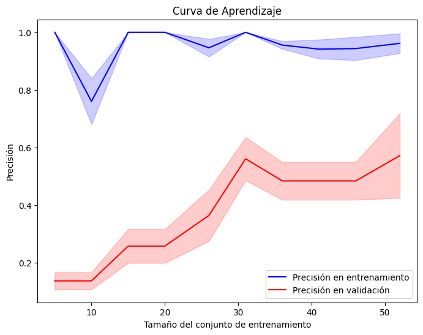

# Clasificador Inteligente de Residuos Reciclables

Conclusiones del proyecto

## Tabla de contenidos

1. [Nombre](#Nombre)
2. [Descripción](#descripción)
3. [Arquitectura](#Arquitectura)
4. [Proceso](#Proceso)
5. [Funcionalidades](#Funcionalidades)
6. [Estado del proyecto](#EstadoDelProyecto)

### Nombre
* Clasificador Inteligente de Residuos Reciclables

### Descripción
Este proyecto consiste en el desarrollo de un modelo de clasificación de residuos utilizando técnicas de Machine Learning. Se implementará un modelo basado en Random Forest para clasificar imágenes de residuos en tres categorías principales: cartón, papel y metal. El objetivo es facilitar la separación de residuos reciclables mediante un sistema automatizado que pueda ser aplicado en aplicaciones web. Para el entrenamiento del modelo, se utilizará un dataset de imágenes de residuos previamente etiquetadas.

### Arquitectura
- La arquitectura del proyecto se puede visualizar a través del siguiente diagrama:
    

- El funcionamiento del proyecto se puede visualizar a través del siguiente diagrama de flujo:
    

### Proceso
* **Fuente de los datasets:** https://huggingface.co/datasets/garythung/trashnet

* **Limpieza de datos:**
    

* **Manejo de excepciones / control de errores:**
    - Se debe subir un archivo de imagen si se desea realizar la predicción, si se usa el botón "Subir y Predecir":
        
    - Otra excepcion...
        
    - Otra excepcion...
        

* **Estadísticos (Valores, gráficos, …):**
    1. Metricas y graficos del modelo de clasificación de residuos reciclables:
        - Cálculo de la precisión del modelo (75%):
            
        - Accuracy, Precision, Recall, F1-Score, Support:
            
        - Grafico de Valores (Precision, Recall, F1-Score):
            
        - Matriz de confusión:
            
        - Curva ROC:
            
    
    2. Metricas y graficos del modelo de chatbot:
        - Distribución de categorías:
            
        - Accuracy, Precision, Recall, F1-Score, Support:
            
        - Matriz de confusión:
            
        - Curva de aprendizaje:
            

### Funcionalidades

- **Integración de un chatbot:**
    - Tecnología / Herramientas usadas: 
- **Uso de cámara para la detección de residuos reciclables:**
    - Tecnología / Herramientas usadas:
- **Integración del proyecto en una página web:**
    - Enlace: (pendiente)
    - Tecnología / Herramientas usadas: HTML, CSS, Tailwind, Flask, Render.
    - Arquitectura (img): La arquitectura del proyecto junto con la integración en una página web se puede visualizar a través del siguiente diagrama:
        

### EstadoDelProyecto
En proceso de desarrollo